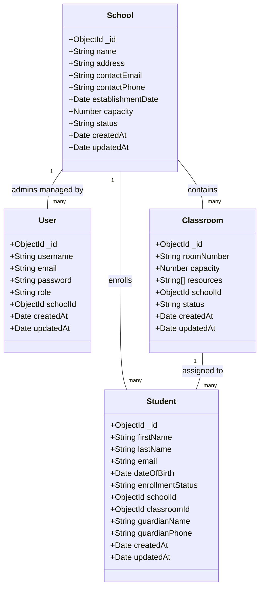

# Database Schema Diagram

The following diagram illustrates the MongoDB schema design and relationships for the School Management System API.

## Entity Descriptions

### User
Represents system users (Superadmins and School Administrators).
- **role**: Enum [`superadmin`, `school_admin`]
- **schoolId**: Reference to `School` (required only for `school_admin`)

### School
Represents a school entity.
- **name**: Unique identifier
- **status**: Enum [`active`, `inactive`]

### Classroom
Represents a physical classroom within a school.
- **schoolId**: Reference to the parent `School`
- **roomNumber**: Unique within a specific school

### Student
Represents a student enrolled in a school.
- **schoolId**: Reference to the `School` the student attends
- **classroomId**: Reference to the assigned `Classroom`
- **enrollmentStatus**: Enum [`active`, `transferred`, `graduated`, `withdrawn`]
